1.申请github帐号:申请完成。

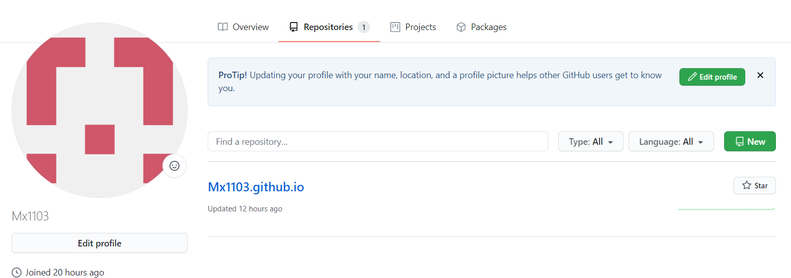  

2.在PC上面配置GIT：  
  2.1在命令模式下，输入如下命令，配置user name 和 user email,
  后，执行下述命令，能够看到新的配置已经有效。git config --list
  
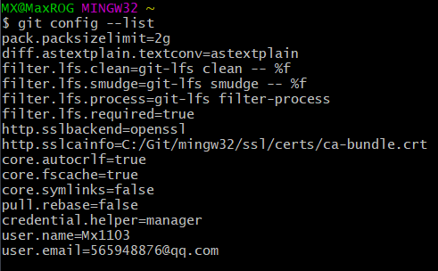 
  

   2.2创建密钥文件

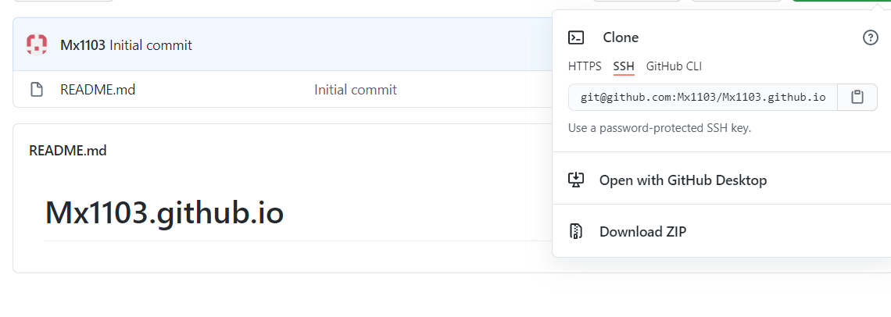 

   2.3将公钥添加到Github:成功。
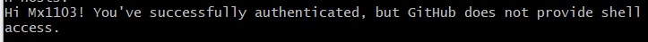 

3. GIT 基本使用方法
3.1 将网站内容clone下来

![5(5.png) 
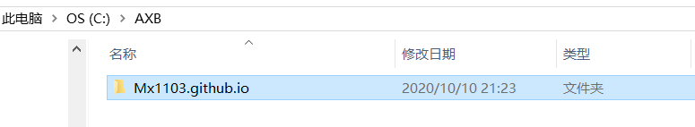 
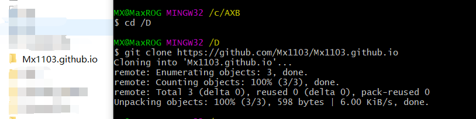 

3.2 查看状态 git status
   3.2.1进入目录，运行命令 git status，看到内容为
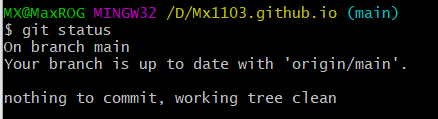 

   3.2.2 修改文件，查看反应

 

   3.2.3 提交到网站git push

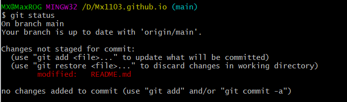 

   3.2.4文件已经被上传到网站，查看是最新文件。2分钟前更新。
   
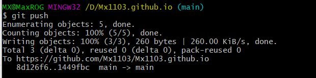

4.安装VCCODE；能够实现在电脑端和云端的数据同步；

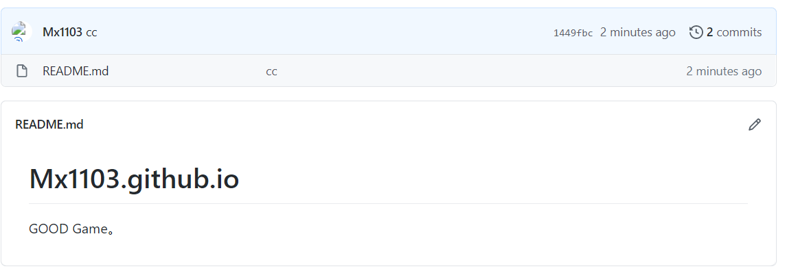

4.1安装

4.2同步
  4.2.1获取token。

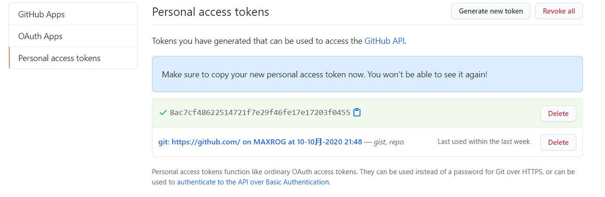

  4.2.2 vscode更新Sync

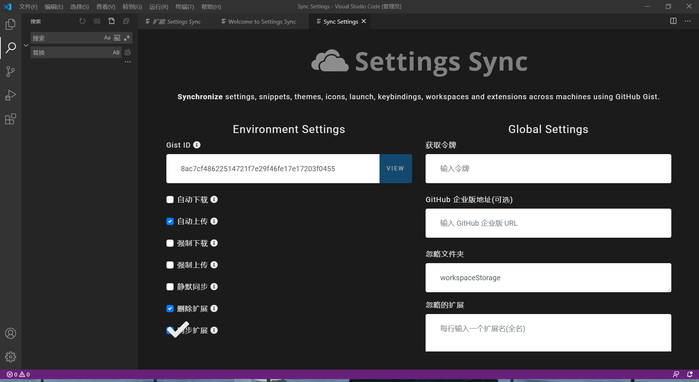

   4.2.3绑定成功，github与VScode为同一个Gist。

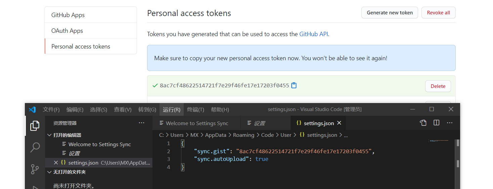

