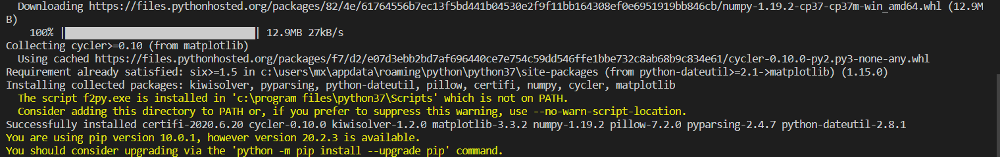
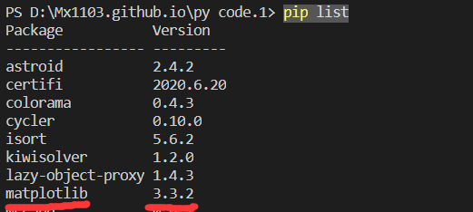
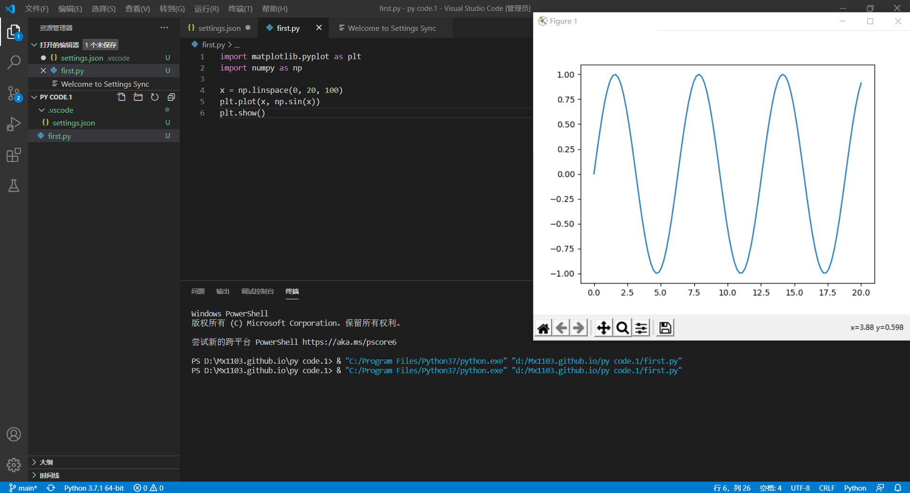
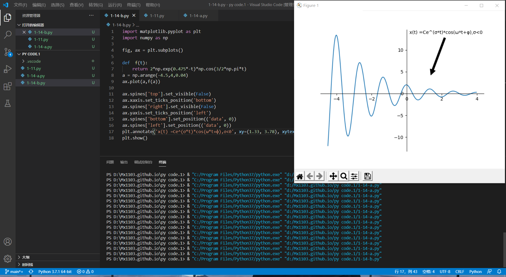
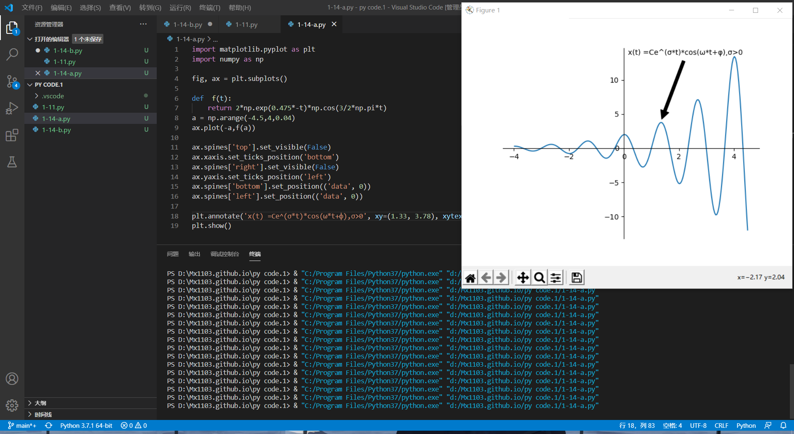
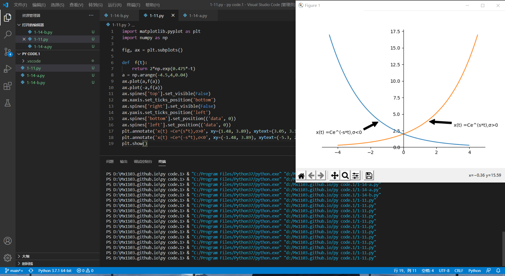
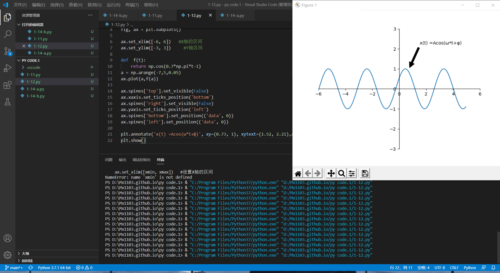

通过实际使用发现Pycharm受限制过多，网站防火墙的隔离，付费的要求，全英文的UI设置  
1.进而转为使用VScode作为python的编译器，下载了py的全局环境  
2.通过查阅，发现可以使用使用python的pyplot绘制函数。  
3.在VScode终端通过pip install matplotlib指令下载matplotlib。 
    
4.在VScode上成功下载matplotlib，  
    
5.试画函数成功  
    
6.使用pip list查看已安装模块包，已经下载完成matplotlib 3.3.2  
7.自学matplotlib的使用方法  
8.1-14b成功画出 
  
9.同理，翻转x轴，1-14a画出  
  
10.依次将剩下的两个函数画出  
  
   
  
